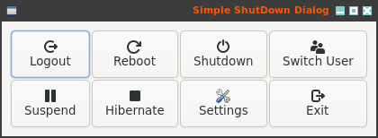
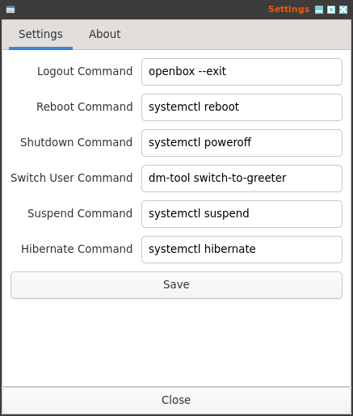

# ssdd: Simple Shutdown Dialog for Openbox

A simple Shutdown Dialog for Openbox written in C using GTK 4






**Simple Shutdown Dialog (ssdd)** is a simple yet stylish shutdown dialog for Openbox, crafted in C using GTK 4.

## Why ssdd?

As a long-time Openbox enthusiast, I've always found the default exit dialog a bit lackluster. Modern systems deserve a more refined shutdown experience. While there are other options out there, I figured one more wouldn't hurt, right?

Inspired by the elegant `ssd` from Sawfish, I decided to create my own tailored solution for Openbox.  This way, you can avoid the hassle of installing extra dependencies and enjoy a sleek shutdown dialog that complements your Openbox setup.

## Features

- **Clean and Intuitive Interface:** ssdd presents clear options for Logout, Reboot, Shutdown, Switch User, Suspend, Hibernate, Settings, and Exit.
- **Configurable Commands:** Easily customize the commands executed for each action via the settings dialog.
- **Lightweight and Efficient:** Designed to be fast and resource-friendly, perfectly suited for Openbox's minimalist philosophy.
- **Modern GTK 4 Interface:** Built with GTK 4 for a modern look and feel.

## Dependencies and Compilation

ssdd requires:

* GTK 4 development libraries
* Glib 2 development libraries
* gcc or clang

### Easy Compilation

Edit the `Makefile` or use the following commands:

```shell
% make all     # Compile
% sudo make install # Install to /usr/local
% sudo make install PREFIX=/usr # Install to /usr
```

### Manual compilation

First generate the resources.

```bash
% glib-compile-resources resources.gresource.xml --generate-source --target=resources.c
% glib-compile-resources resources.gresource.xml --generate-header --target=resources.h
```

```bash
# Using GCC:
% gcc ssdd.c resources.c -o ssdd `pkg-config --cflags --libs gtk4`

# Using Clang:
% clang ssdd.c resources.c -o ssdd `pkg-config --cflags --libs gtk4`
```

Place the `ssdd` binary in your `$PATH` (e.g., `~/bin`).

### Integrate with Openbox

1. Edit your Openbox menu:

```bash
% sudo nvim /etc/xdg/openbox/menu.xml
```

2. Replace the default Exit entry with:

```xml
<item label="Log Out"><action name="Execute"><execute>ssdd</execute></action></item>
```

3. Reconfigure Openbox:

```bash
% openbox --reconfigure
```

### Contributing

Contributions are welcome! Feel free to open issues or submit pull requests.

